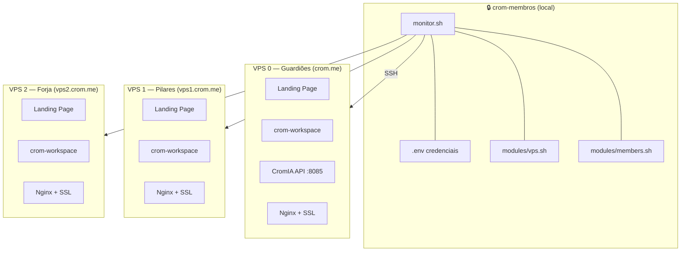
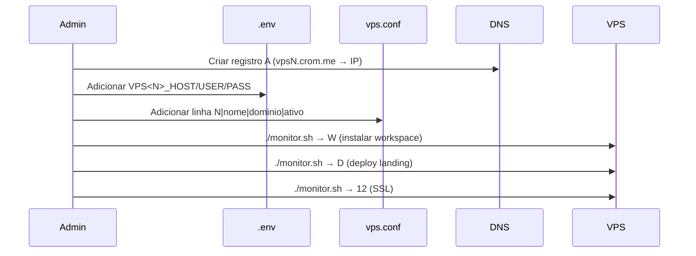
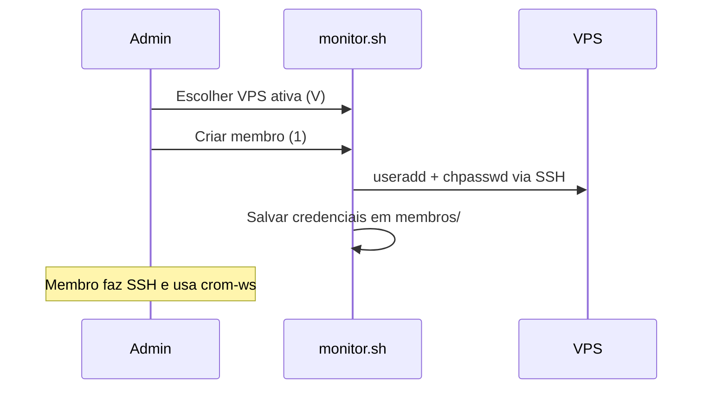

# 🏗️ Arquitetura Multi-VPS — Ecossistema CROM

## Visão Geral

O ecossistema CROM opera com múltiplas VPS gerenciadas de forma centralizada pelo **orquestrador** (`crom-membros`). Cada VPS é um servidor independente que pode hospedar membros e serviços.

## Fluxo de Operações

### Adicionar Nova VPS

### Adicionar Membro

## Componentes

| Componente | Localização | Função |
|-----------|-------------|--------|
| `monitor.sh` | Local (orquestrador) | Menu interativo multi-VPS |
| `modules/core.sh` | Local | SSH, .env, select_vps() |
| `modules/vps.sh` | Local | Gestão de VPS |
| `modules/members.sh` | Local | CRUD de membros |
| `modules/system.sh` | Local | Relatórios, serviços |
| `modules/cromia.sh` | Local | Gestão CromIA |
| `crom-workspace/` | Local + VPS | CLI para membros |
| `infra/vps.conf` | Local | Registro de VPS |
| `.env` | Local (gitignored) | Credenciais |

## Rede

| Domínio | IP | Função |
|---------|----|---------| 
| crom.me | 76.13.165.69 | Portal principal |
| cromia-api.crom.me | 76.13.165.69 | API de IA |
| vps1.crom.me | (TBD) | Servidor Pilares |
| vps2.crom.me | (TBD) | Servidor Forja |
| crom.run | 148.230.79.173 | Site comunidade |
